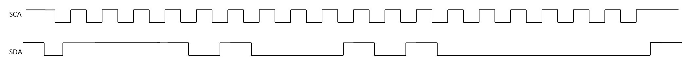
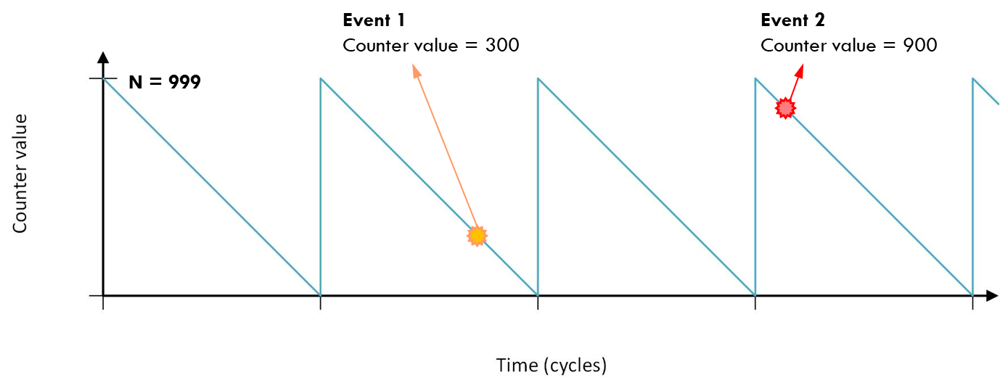
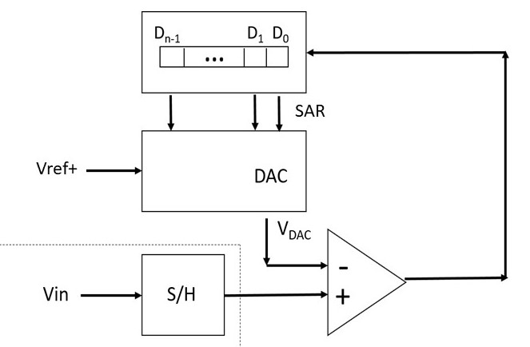
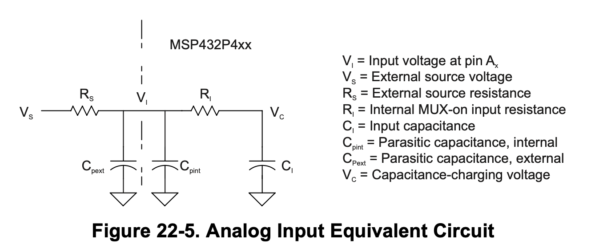

# bit operations

|       | operation |
| ----- | --------- |
| mask  | &         |
|       | \|        |
| clear | ~&        |
# Connections
## launchpad
| Launchpad Pin | Pin Function |
| ------------- | ------------ |
| P1.1          | Button 1     |
| P1.4          | Button 2     |
| P1.0          | LED 1        |
| P2.0          | RED LED      |
| P2.1          | GREEN LED    |
| P2.2          | BLUE         |
## boosterpack
| Launchpad Pin | RGB LED Pinout BoosterPack Module Header Connection | Pin Function  |
| ------------- | --------------------------------------------------- | ------------- |
| P2.6          | J4.39(1)                                            | Red channel   |
| P5.6          | J4.37                                               | Blue channel  |
| P2.4          | J4.38                                               | Green channel |

| Launchpad Pin | BoosterPack Plug-in Module Header Connection | Pin Function |
| ------------- | -------------------------------------------- | ------------ |
| P5.1          | J4.33                                        | S1 button    |
| P3.5          | J4.32                                        | S2 button    |

| Launchpad Pin | BoosterPack Plug-in Module Header Connection | Pin Function |
| ------------- | -------------------------------------------- | ------------ |
|               |                                              | Speaker      |
|               |                                              | Microphone   |
# driver lib
1. No HAL and no DriverLib: not portable
2. DriverLib, but no HAL: not portable
3. HAL, but no DriverLib: portable

|           | non active | active |
| --------- | ---------- | ------ |
| Pull up   | 1          | 0      |
| pull down | 0          | 1      |
- if we wish to configure a pin as an **input** with a pull-down resistor, DIR register should be 0 , REN register should be 1 , and OUT register should be 0 .
- if we wish to configure a pin as an **output**, DIR register should be 1 , REN register does not matter , and OUT register does not matter 
# compiler


| readable | assembly      | machine code |
| -------- | ------------- | ------------ |
| HLL      | assembly file | object       |
| .c files |               | executable   |
- The tool that combines object files to create one executable is called a linker
- The tool that translates assembly to machine code is called an assembler

| printf ref | data type     | bytes (8 bits) | biggest/smallest number |
| ---------- | ------------- | -------------- | ----------------------- |
| %d or %i   | int           | 4              | +-2^15                  |
|            | short         | 2              | +-2^15                  |
| %f         | float, double | 4, 8           |                         |
| %p         | address       |                |                         |
| %u         | unsigned int  | 4, 8           |                         |
| %lu        | unsigned long |                | 2^32-1                  |
| %l         | long          |                |                         |
| %c         | char          | 1              |                         |
# memory and registers


| data             | stack                     | heap                            | text                 |
| ---------------- | ------------------------- | ------------------------------- | -------------------- |
| static variables | local variables           | dynamically allocated variables | program instructions |
| global vars      | return variables          | arrays type shi                 |                      |
|                  | (grows high address down) | (grows low address up)          |                      |

|       | port 1    | port 2    | port 3    | port 4    | port 5    | port 6    |
| ----- | --------- | --------- | --------- | --------- | --------- | --------- |
| PxIN  | 4000_4C00 | 4000_4C01 | 4000_4C20 | 4000_4C21 | 4000_4C40 | 4000_4C41 |
| PxOUT | 4000_4C02 | 4000_4C03 | 4000_4C22 | 4000_4C23 | 4000_4C42 | 4000_4C43 |
| PxDIR | 4000_4C04 | 4000_4C05 | 4000_4C24 | 4000_4C25 | 4000_4C44 | 4000_4C45 |
| PxREN | 4000_4C06 | 4000_4C07 | 4000_4C26 | 4000_4C27 | 4000_4C46 | 4000_4C47 |

# FSM
## complex designs (most to least)
1. turing machine
2. pushdown automaton
3. finite-state machine
4. combinational logic
## Moore Machine
possible transition states = possible values
# communication
Sample data in the middle of the bit
- **bitrate** data rate including non data bits
	2 bits -> 2 \* baudrate
- **baudrate** number of symbols transferred per second
- **data rate** only data bits. usually smaller than bitrate
**Example**:
UART: 8N1 (8 data bits, no parity, 1 stop), 1000 baud/s
bitrate = 1000 bit/s
datarate = $\frac{8 \text{bits}}{10 \text{baud}}*1000 \text{baud/s}$


**f$_{clock}$** =48\*10$^{6}$
**baudrate** = 57600
**N** $= \frac{f_{clk}}{baudrate}=833.333$
**UCBRx** = INT$(\frac{N} {16})$
**UCBRFx** =INT\[ ($\frac{N}{16}-$ INT$(\frac{N} {16})*16$) \]  = 1


convert the hex result into binary. where there is a 1, add 1 to int(N)


|                         | uart                              | spi                                             | i2c                           |
| ----------------------- | --------------------------------- | ----------------------------------------------- | ----------------------------- |
|                         | full-duplex                       | full-duplex                                     | half-duplex                   |
|                         | serial                            | serial                                          | serial                        |
|                         | async                             | synchronous                                     | synchronous                   |
| slave                   |                                   | SS decides                                      | send the address of the slave |
| start                   | start bit                         | SS decides                                      | conditional of SCL and SDA    |
| stop                    | stop bit                          | SS goes back to 1                               | stop condition                |
| r/w                     | independent                       | at the same time                                | r/w bit                       |
| ack/check               | optional parity bit by the sender |                                                 | ack bit sent by receiver      |
| transmitter update data | once a full bit/baud has complete | configurable to rising or falling edge of clock | clock is low                  |
| data is sampled         | in the middle of baud/bit         | configurable                                    | clock is high                 |
| # of pins               | 2, rx and tx                      | 4 pins, +3 pins for each direct connect slave   | 2                             |
| # of slaves             |                                   | max 55 pins -> 18 slaves                        | 128                           |
| # of masters            |                                   | 1                                               | multiple masters              |
## UART
32Mhz, 58,600, N=546.075

| name            | formula                                      | example     |
| --------------- | -------------------------------------------- | ----------- |
| clock prescaler | INT($\frac{N}{16}$)                          | 34          |
| first mod reg   | INT(N) - INT$(\frac{N}{16})*16$              | 2           |
| second mod reg  | N - (clock prescaler)$*16$ - (first mod reg) | =.075->0x02 |
| oversamping     | N > 16                                       | 1           |
0x02 -> 000000==1==0
546, 546, 546, 546, 546, 546, ==547==, 546,
## SPI

### direct config

### daisy chain

## i2c


| sda       | scl   |
| --------- | ----- |
| data line | clock |

- can operate at 10 kbits/s, 100kbits/s, 400kbit/s, 1Mbit/s, 3.4Mbit/s
- limited number of addressable devices (defined by slave manufacturer)
- bus capacitance limits (400pF) comm to a few meters
- adress is 7 bits - 128 possible address


the master will... Read = 1 and Write = 0
**Example**


| address | r/w   | data     |
| ------- | ----- | -------- |
| 1111010 | 0     | 10100000 |
| 0x7a    | write | a0       |
# Hardware components
## screen

\* 127 not 128
## brownout reset

| voltage drop | example voltage | frequency | power consumption | operation                  |
| ------------ | --------------- | --------- | ----------------- | -------------------------- |
| neglible     | .95             | 3 MHz     | typical           | normal                     |
| small        | .8              | 2 MHz     | low               | power-saving mode          |
| medium       | .5              | 1.8 Mhz   | very low          | mistakes, security attacks |
| large        | .2              |           | zero              | not working                |
### single threshold

CPU will turn off at T1
### dual threshold
CPU will turn off at V$_{TL}$ and will not turn on until V$_{TH}$

## watchdog timer (WDT)

```
#define WDT_A_CLOCKITERATIONS_2G
#define WDT_A_CLOCKITERATIONS_128M
#define WDT_A_CLOCKITERATIONS_8192K
#define WDT_A_CLOCKITERATIONS_512K
#define WDT_A_CLOCKITERATIONS_32K
#define WDT_A_CLOCKITERATIONS_8192
#define WDT_A_CLOCKITERATIONS_512
#define WDT_A_CLOCKITERATIONS_64
```
$t = \frac{N*P}{f}$
`WDT_A_clearTimer();`
## Direct Memory Access (DMA)
Transfer big chunks of data from memory to another device without bothering the microprocessor


## Cyclic Redundancy Check (CRC)
Data corruption detection mechanism
## Advanced Encryption Standard (AES)
Turn Plaintext into ciphertext
## RTOS
**Quiz 40**
Which one of the below did we use for our projects this semester? Bare Metal
- RTOS is always free. F
- RTOS is always very complicated and one cannot build his/her own RTOS. F
- There is a variety of options available for RTOS. T

- Which one gives you more control over the flow of program execution? Bare metal
- Which one is easier to test and debug? Bare metal
- Which one is better suited to support sophisticated User Interfaces? RTOS
- Which one improves the time-to-market in complicated applications with multiple tasks? RTOS

- When a task is critical and needs to be done under a certain condition reliably, the best approach is to use RTOS. F
- For applications with too many tasks especially complicated user interfaces, RTOS is more suitable. T
# timers
largest number is $2^{32}-1$ , where 32 is the option 32 bit or 16bit
for larger values use a rescaler 
$T = \frac{N*P}{f}$ T is the period (s), N is the clock cycles(cycles), f is the clock frequency($\frac{cycles}{seconds}$), and P is the prescaler
## rollovers and values

$T_{2}-T_{1} = (R_2-R_1)(N+1)+(C_{1}-C_{2})$    2$^T$ Rollover
t is the system clock, C is the counter
N is the Load value
R is the number of rollovers at T$_2$ 
**Example**

|           | value  |
| --------- | ------ |
| clock     | 30 MHz |
| load      | 13,999 |
| prescaler | 16     |
| R$_1$     | 63     |
| C$_1$     | 2500   |
| t         | .5 s   |
$\Delta T= \frac{.5 * 30*10^6}{16} = 937,500$ 
$=(R_2-63)(13,999+1)+(2500)$
## timerA
| Pin Function      | Launchpad Pin | BoosterPack Pin | Timer |
| ----------------- | ------------- | --------------- | ----- |
| Booster Green LED | P2.4          | J4.38           | TA0.1 |
| servo motor       | P2.5          | J2.19           | TA0.2 |
| Booster Red LED   | P2.6          | J4.39           | TA0.3 |
| Buzzer            | P2.7          | J4.40           | TA0.4 |
| Booster Blue LED  | P5.6          | J4.37           | TA2.1 |
| Timer Capture     | P6.6          | J4.36           | TA2.3 |
| Timer Capture     | P6.7          | J4.35           | TA2.4 |
timerA is 16 bit


PWM frequency = $\frac{f_{clk}}{\text{CCR0}*P}$

### buzzer
minimum prescaler (round up)
$p=\frac{f_{clk}}{f_{note}*2^{16}}$
$N=\frac{P}{f_{clk}*f_{note}}$

## timer32
largest...

|                   | value                            |
| ----------------- | -------------------------------- |
| prescaler         | 256                              |
| load value N      | 2^32 - 1 = 4294967295            |
| duration of timer | $\frac{(2^{32}-1)*256}{f_{clk}}$ |
# ADC

| Joystick | Port.Pin |
| -------- | -------- |
| x        | P6.0     |
| y        | P4.4     |

span (range)
$V_{+} - V_{-}$

possible outputs (resolution)
$2^n$

resolution
$\frac{V_{+} - V_{-}}{2^n}$

LSB voltage value
$LSB=\frac{1}{2^n}*(V_H-V_L)$

MSB voltage value
MSB = V$_H$

digital value (round down)
$D=\frac{V_{in}-V_L}{V_H-V_L}*2^n$

analog value
$V_{out}=\frac{D}{2^n}*(V_H-V_L)-V_L$
## Successive Approximation Register (SAR)

**Example**

| vin  | n   | vref+ | vref- |
| ---- | --- | ----- | ----- |
| 3.43 | 4   | 4     | 0     |

| round | $V_{DAC}$ (Guess) | Bit index | resolved bit value |
| ----- | ----------------- | --------- | ------------------ |
| 1     | 2                 | 3         | 1                  |
| 2     | 3                 | 2         | 1                  |
| 3     | 3.5               | 1         | 0                  |
| 4     | 3.25              | 0         | 1                  |
**guess**$_k$ = guess$_{k-1} \div 2$, until resolution
**resolved bit value** is 1 for guess too low, 0 for guess too high

speed
n$*$period per bit
## Flash Converter

Materials

| opamps  | resistors |
| ------- | --------- |
| $2^n-1$ | $2^n$     |
benefits are very fast conversion
LSB = $\frac{V_+-V_-}{n}$

## Comparator E
Similar to ADC voltage comparison
## Ref A
Generate various analog voltages needed by peripherals, such as the ADC reference voltages
# DAC
## Binary-Weighted Ladder

highest value resistor: $2^{n-1}*R$
## R-2R Ladder

highest value resistor: $2*R$
current through resistor = $\frac{1}{2^n}$
vout = V$*(\sum_{n=1}^{\infty}\frac{1}{2^n})$
# Sample/Hold (S/H)

maximum frequency from RC
$f=\frac{1}{(n+1)\ln{(2)}*RC}$
- you need two switches
- capacitors do no prevent a short
- resistor are needed for the S/H circuit and change speed
- The delay of the S/H circuit is increased exponentially when the size of the capacitor is increased linearly. False
- The sampling speed of the S/H circuit is increased when the size of the resistor is decreased

sampling frequency = 2 $*$ bandwidth frequency
Dynamic Range $*$ Gain <= EFSR
# interrupts

asynchronous”; they can be generated by devices or by the timer.
Within the ISR, it should send a command to the interrupt  source to remove the interrupt before exiting the ISR!

|                                                                      | Regular function                                                        | ISR                                                                                                                   |
| -------------------------------------------------------------------- | ----------------------------------------------------------------------- | --------------------------------------------------------------------------------------------------------------------- |
| Can have inputs?                                                     | yes                                                                     | No (communicate via  <br>global variables)                                                                            |
| Can have outputs?                                                    | yes                                                                     | No                                                                                                                    |
| Who decides the  <br>address of the function?                        | Compiler/linker/loader  <br>decide the address of  <br>the functions    | it is pre-decided for  <br>each interrupt                                                                             |
| Who decides the name  <br>of the function?  <br>Registration needed? | Programmer, no special  <br>registration or extra  <br>handling is need | Either a predefined  <br>name should be used or  <br>you should register the  <br>function to be known as  <br>an ISR |

|                                                                | Interrupt-based         | Polling-based           |
| -------------------------------------------------------------- | ----------------------- | ----------------------- |
| Use of global variables?                                       | yes                     | Not necessary           |
| Quick Response?                                                | fast                    | Could be slow           |
| Structure of the code?  <br>Ease of debugging and  <br>testing | Harder to write & debug | Easier to write & debug |
| Low-power?                                                     | yes                     | no                      |

The location of the ISR’s address (the interrupt address vector) depends on the design of the  
microprocessor.

Interrupt enable:  
- the bit in Interrupt Controller that allows the interrupt trigger  to pass  
Interrupt flag:  
- the bit that shows a valid (enabled) interrupt has occurred  
Interrupt priorities  
- A set of variables that decide which interrupt has priority over  another  
 Interrupt Vector:  
- The address of the ISR of an interrupt  
 Interrupt Vector Table:  
- An architectural entity that stores all the interrupt vectors

## program step
1. clear interrupt flag
	`GPIO_clearInterruptFlag(GPIO_PORT_P1, GPIO_PIN1);`
2. set interrupt source
	`GPIO_enableInterrupt(GPIO_PORT_P1, GPIO_PIN1);`
	`GPIO_interruptEdgeSelect(GPIO_PORT_P1, GPIO_PIN1, GPIO_HIGH_TO_LOW_TRANSITION);`
3. enable interrupt in controller
	`Interrupt_enableInterrupt(INT_PORT1);`
4. set up ISR in vector table and write ISR
	```c
	void PORT1_IRQHandler(){
		if(GPIO_getInterruptStatus(GPIO_PORT_P1, GPIO_PIN1))
		// some global value
	}
	GPIO_clearInterruptFlag(GPIO_PORT_P1, GPIO_PIN1);
```
5. write main function that interfaces with ISR
	regular functions