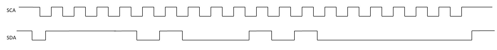

# Quiz 33
An interrupt is active while it is being serviced.
- It is not possible to have more than one active interrupt. T
- It is not possible to have more than one pending interrupt. F
- A high-priority interrupt can stop the execution of a lower priority interrupt's ISR. T
A hardware event that initiates the interrupt is an interrupt trigger

In order to enable an interrupt source to "interrupt" the processor, which action is needed?
- enabling an interrupt enable flag that is associated with this source only.
- Configuring the interrupt source such that it can activate an interrupt trigger.
ISR has neither input arguments nor returned value.
- ISR stands for Interrupt Service Register. F (Interrupt Service Routine)
- Another name for ISR is interrupt handler. T
- ISR is essentially a function. T
How do we clear an interrupt? We send a command to the interrupt source to remove the interrupt.
For each type of function, who decides its address?
- **regular function** the software toolchain (compiler/linker/loader)
- **ISR** the vector table within the interrupt controller
# Quiz 34
the task that any properly designed ISR should do is to Tell the interrupt source to clear the interrupt
In our development environment including library files, stater code, etc, where can we find the names of the ISR functions? In startup_msp432p401r_ccs.c
How does ISR communicates with other functions in the program? Using global variables.
What is the name of the ISR for the UART on our kit that gets connected to the computer as we used in project 1? EUSCIA0_IRQHandler

In the basic_example_interrupts code, the two global variables are volatile. Learn more about volatile variables here:
[https://en.wikipedia.org/wiki/Volatile_(computer_programming)](https://en.wikipedia.org/wiki/Volatile_(computer_programming))
What may happen if we do not put the volatile keyword in the variable declaration for S1modifiedFlag?
The compiler might modify the main function assuming S1modifiedFlag is always false and no one sets it to true. So, it may delete line 69 to 78 to improve the code.

1. Using which method guarantees a faster response to a hardware event? using interrupts and ISR
2. Development, debugging, and testing of which type of code is easier? A code written by polling the hardware triggers.
3. Which type of code development lends itself well to building low-power smart devices?A code that waits for peripheral inetrrupts
4. Which type of program is allowed to use global variables. Interrupt-based programming can use global variables for communication between ISR and other parts of the code only.
# Quiz 35
- 2C is pronounced 'eye two see'. F (i squared c)
- I2C is a synchronous serial interface. T
- I2C needs pullup resistors on the SDA and SCL terminals. T
- I2C uses half-duplex data transfers. T
When you buy a chip with an I2C interface, who decides on the I2C address used by that chip? The chip manufacturer

- In I2C, masters are able to drive the data line to zero.
- In I2C, masters are not able to drive the data line to one.
- In I2C, slaves are able to drive the data line to zero.
- In I2C, slaves are not able to drive the data line to one.
In I2C who can create the stop condition to finish the communication? only masters

- Who creates the start condition? master
- Who decides if the transfer is a read or write? master
- What is the address of the slave? 0x7a
- Who sends out the address in the above example? master
- Who sends out the data in the above example? master
In I2C, a slave can be either sender or receiver , and a master can be a sender or receiver.
In I2C, during the high phase of the clock, **the receiver** is active and working, while during the low phase of the clock, **the sender** is working.
# Quiz 36
Where can we find the I2C slave address of the temperature sensor? tmp0006 datasheet

What is the light sensor slave address in our kit? Enter your answer as a decimal value. Hint: you need to check both the light sensor datasheet and the BoosterPack guide to see how the light sensor is configured on our board. >68
Which eUSCI module on MSP432 is connected to the light sensor and temperature sensor on our kit? UCB1

1. It is part of the UART module only.
2. It is part of the I2C module only.
3. It is part of both UART and I2C modules.
4. It is not part of either of the UART or I2C modules.
You need to decide for the following components:
- Clock source multiplexer 3
- Clock Prescaler 3
- open-drain transistor 2
- Receive shift register 3
- Schmitt trigger 4
- Slave address 2  
- Modulator 1
- An inverter gate 2
# Quiz 37
Which component is at the heart of an SPI module? A shift-register

- In SPI, it is possible to configure on what phase/edge of the clock the master and slaves should sample the data. T
- In SPI, it is possible that the master and the slaves sample the data at two different phase/edges (e.g. one during rising edge and another during falling edge). F
- In SPI, only the master can drive the clock. T
- In SPI, activating the Slave Select signifies the start of communication. T
In SPI, what happens if a master needs to read a byte from the slave, but does not need to send any data? Master sends a dummy byte in exchange for the desired data.
MOSI pin on the initiator/master can connect to what pins on the follower/slave? (choose all that are possible) SIMO, MOSI
Based on the figure shown in class (the one with the shift register), what bit is transferred in the first clock cycle of the SPI communication? MSB

| daisy-chain          | cheaper but slower            |
| -------------------- | ----------------------------- |
| direct-configuration | faster but needs more SS pins |
In the figure with three followers connected to one initiator in a daisy chain shown in class, how many clock cycles does it take for one byte of data from the Slave #2  (the middle one) to reach the master (after SS is activated)? 16
When the polarity of the clock is 1 and the phase of the clock is 0, what happens on the falling edge of the clock? Both the initiator and the follower are sampling data (reading).
# Quiz 38
Which component on MSP432 can be configured to be used as SPI? Choose all that applies.
1) eUSCI_A2 (yes )
2) eUSCI_B0 (yes )
3) eUSCI_A5(no )
4) AES256 (no )
5) LCD display (no )

1. It is part of the SPI module only.
2. It is part of the I2C module only.
3. It is part of both SPI and I2C modules.
4. It is not part of either of the SPI or I2C modules.
You need to decide on the following components:
- Clock source multiplexer 3
- open-drain transistor 2 
- Transmit Buffer 3
- Transmission gate 4
- Slave address 2
- Modulator 4
- Clock Direction, Phase, and Polarity 1
How does MSP432 communicate with the LCD display? (Answer Y for all that applies)
- Using I2C N
- Using SPI Y
- Using digital I/O pins Y
- Using ADC N
- Using Timer_A PWM Y
# Quiz 39
Robustness generally refers to the capability of a micro-controller or its software to deal with unexpected events, such as faults and loss of power. true
When does a brownout situation occur? When the operating voltage of the microcontroller drops to a point that the processor starts to make mistakes.
How many voltage thresholds are needed for a proper implementation of brownout reset? two

1. At the heart of a watchdog timer is a counter that tries to count between 0 and the load value. T
2. The counter in the watchdog timer should be reset (loaded with 0) on a regular basis by the software. T
3. If the counter in the watchdog timer overflows (rolls over), the processor is reset. T
4. Resetting a watchdog timer resets the processor. F
5. When a processor faces a hardware or software issue and is stuck, it fails to reset the watchdog timer. T  
6. Resetting the watchdog timer on a regular basis acts as a healthy pulse for the processor status. T

Consider a processor with a system clock of 4MHz and initialization of the watchdog timer as below:
WDT_A_initWatchdogTimer(WDT_A_CLOCKSOURCE_SMCLK, WDT_A_CLOCKITERATIONS_2G);
How long after clearing the watchdog time it takes for the watchdog timer to reset the processor? 500 seconds
# Quiz 40
- DMA stands for Direct Memory Accelerator. F (Direct Memory Access)
- DMA allows for direct data transfer between the memory and other peripherals. T
- CPU can be in low-power mode while DMA handles data transfers.

- RAM is volatile
- ROM is non-volatile
- Flash is non-volatile

| type  | diff     |
| ----- | -------- |
| ram   | easiest  |
| flash | moderate |
| fom   | hardest  |
Where can stack and heap be located in MSP432? RAM
Where can Driverlib functions be located in MSP432? RAM, ROM, Flash

|        | application                       |
| ------ | --------------------------------- |
| crc32  | error checking (data corruption)  |
| aes256 | encryption engine (data security) |
| comp_e | analog comparator                 |
Which peripheral on MPS432 is connected to the accelerometer? ADC
Which peripheral on MPS432 is connected to the microphone? ADC

For each of the below functions, decide whether they are stored on ROM or not on ROM.
- MAP_WDT_A_initIntervalTimer ROM
- MAP_WDT_A_registerInterrupt not on ROM

In the examples, we covered in this class, who decides what part of code is run at any given time? The flow of the program as was written in the project decides what part of the code is run next.

Which one of the below did we use for our projects this semester? Bare Metal
- RTOS is always free. F
- RTOS is always very complicated and one cannot build his/her own RTOS. F
- There is a variety of options available for RTOS. T

- Which one gives you more control over the flow of program execution? Bare metal
- Which one is easier to test and debug? Bare metal
- Which one is better suited to support sophisticated User Interfaces? RTOS
- Which one improves the time-to-market in complicated applications with multiple tasks? RTOS

- When a task is critical and needs to be done under a certain condition reliably, the best approach is to use RTOS. F
- For applications with too many tasks especially complicated user interfaces, RTOS is more suitable. T